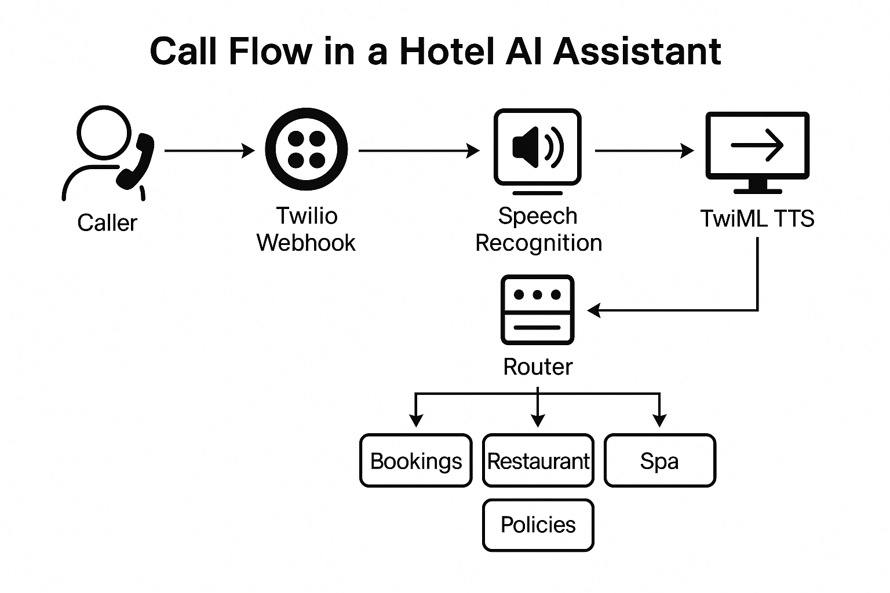

# Hotel Voice Integration

This directory contains optional voice‑handling components that extend
your existing hotel concierge AI to support real phone calls.  The
files here can be added to your project without conflicting with
your Streamlit UI or routing logic.  They use Twilio’s
Programmable Voice service to receive calls, gather speech
transcripts and speak back responses using TwiML `<Say>`.

## Components

| File | Description |
| --- | --- |
| `voice_server.py` | Flask application exposing `/voice` and `/process` endpoints.  Handles call setup, speech transcription (via Twilio), routing and responses.  Maintains session state across multi‑turn conversations. |
| `stt_tts_utils.py` | Optional helpers for using OpenAI Whisper and Google Text‑to‑Speech if you wish to run your own speech processing.  Not used by default. |
| `demo_call_flow_diagram.png` | Flowchart illustrating the end‑to‑end call flow: caller → Twilio → voice server → AI agents → Twilio → caller.  Useful for presentations. |
| `ngrok_setup.bat` | Convenience script for Windows users to start an [ngrok](https://ngrok.com) tunnel on port 8000.  This makes your local server accessible on a public URL for Twilio webhooks. |

## Installation

1. **Install dependencies**:  In addition to your existing requirements, you will need `flask` and `twilio`.  Add the following lines to your `requirements.txt` or install directly:

   ```
   flask>=2.0
   twilio>=8.0
   fastapi>=0.110  # optional if using FastAPI instead of Flask
   gtts>=2.0.0     # optional for `stt_tts_utils.py`
   ```

2. **Set up environment variables**:  Create or update your `.env` file with your OpenAI API key and optionally set the model name:

   ```env
   OPENAI_API_KEY=sk-xxxxxxxxxxxxxxxxxxxxxxxxxxxxxxxxxxxxxxxxxxx
   MODEL_NAME=gpt-4o-mini
   ```

   These variables are read by `voice_server.py` for classification.  The agents themselves (FAQ, booking, etc.) should already be configured to read your OpenAI key.

3. **Run the voice server**:  From the root of your project run:

   ```bash
   export FLASK_APP=hotel_voice_integration/voice_server.py
   flask run --host=0.0.0.0 --port=8000
   ```

   The server will start listening on port 8000 for Twilio webhooks.  You may change the port if necessary (but update `ngrok_setup.bat` accordingly).

4. **Expose your server with ngrok**:  Twilio must reach your local machine over HTTPS.  Use ngrok to create a secure tunnel:

   ```bash
   ngrok http 8000
   ```

   Copy the HTTPS forwarding URL that ngrok displays (e.g. `https://abcd1234.ngrok.io`).  Windows users can double‑click `ngrok_setup.bat` to do this automatically.

5. **Configure your Twilio phone number**:  In the Twilio Console:

   - Purchase or select a phone number capable of voice.
   - Under **Voice & Fax** settings, set **A Call Comes In** to **Webhook**.
   - Enter your ngrok URL with `/voice` appended, e.g. `https://abcd1234.ngrok.io/voice`.
   - Save the configuration.

Twilio will now POST to your `/voice` endpoint when a call arrives.  The
voice server will greet the caller, gather a speech transcript and
process the request via your AI agents.  The response is spoken
using Twilio’s built‑in Text‑to‑Speech.  Multi‑turn conversations are
supported using the CallSid as a session key.

## Usage notes

* **Routing**:  `voice_server.py` uses the same classification logic
  as your Streamlit router to route queries to the appropriate
  specialised agent.  It maintains a simple in‑memory session per
  call to support multi‑turn booking flows.
* **Speech recognition and synthesis**:  By default the server
  relies on Twilio to transcribe the caller’s speech and to speak
  your AI’s replies.  If you wish to run your own STT/TTS pipeline,
  use the functions in `stt_tts_utils.py` and adjust the TwiML
  responses to play back audio files.
* **Security**:  Do not commit your `.env` file to version control.
  Restrict access to your voice server and logs.  For production
  deployments consider running behind a secure reverse proxy and
  storing session data in a persistent database or cache.

## Flow diagram



The diagram above shows the overall flow of a call through the
system.  The caller speaks to Twilio, which forwards the speech to
your voice server.  The server transcribes and routes the text to
your AI agents.  The agent’s reply is then spoken back to the
caller via Twilio.